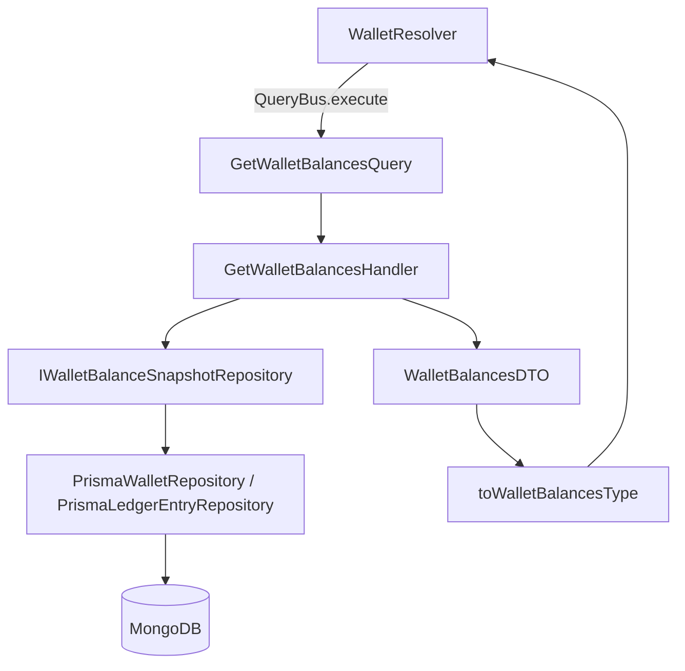

# Errandy Backend

Errandy Backend powers an errand marketplace that connects clients who need tasks completed with providers who can fulfill them. The backend is a DDD and EIP-driven NestJS GraphQL monolith, backed by Prisma and MongoDB, with bounded modules for escrow, wallet, errands, applications, users, providers, clients, ratings, chat, and supporting domains.

## Architecture

The domain layer contains aggregates, value objects, domain errors, repository interfaces, domain services, and domain events. It is persistence-ignorant: no Prisma models, GraphQL decorators, or adapter concerns leak into business rules.

The application layer contains CQRS command handlers, query handlers, sagas, event handlers, and BullMQ jobs. Commands and queries are dispatched through NestJS `CommandBus` and `QueryBus`, while `EventBus` provides one-to-many publication for domain events after persistence succeeds.

The infrastructure layer implements repositories, mappers, and external adapters. Prisma repositories convert between persistence rows and domain aggregates, while adapters wrap Paystack, Firebase, Redis, BullMQ, email, and push integrations behind module-owned interfaces.

The presentation layer exposes GraphQL resolvers and GraphQL object types. Resolvers inject buses rather than repositories, and presentation mappers convert application DTOs into GraphQL shapes, including typed aggregate IDs rendered as strings.



## Core Domains

### Escrow

Escrow owns the payment hold around an accepted errand. Its key rule is a two-phase hold: funds back active work first, then move through a post-completion clearance window before worker funds become available.

### Wallet

Wallet owns all internal money movements after external payment outcomes are known. Balances come from append-only `LedgerEntry` records, with materialized snapshots used for fast reads and replayable audit.

### Errands

Errands owns task lifecycle: creation, publication, assignment, completion, cancellation, pricing, recurrence, and service references. Other modules react to errand lifecycle events instead of mutating errand state directly.

### Application

Application owns provider applications to errands, including submission, acceptance, rejection, cancellation, and uniqueness per worker per errand. Acceptance starts a saga that coordinates escrow funding, errand assignment, and cancellation of competing applications.

### Users, Provider, And Client

Users owns identity profile data and active address selection. Provider owns worker profile, verification, skills, discovery fields, and rating snapshots. Client owns requester profile and dashboard read models.

### Rating

Rating owns post-errand reviews, reactions, replies, and rating statistics. It enforces score bounds and one rating per rater per errand, then emits events that update Provider and Client rating snapshots.

### Chat

Chat owns rooms, participants, messages, read state, and message broadcast events. Messages are persisted before publication so subscriptions reflect durable conversation history.

### Supporting Domains

Address owns saved addresses and geocoding results. Dispute records evidence and resolution decisions, then routes outcomes to Escrow. Payment Gateway normalizes Paystack payment methods and webhooks. Notification translates domain events into channel-specific dispatches.

## Key Design Decisions

### Ledger-Based Wallet

Wallet balances are derived from an append-only ledger rather than mutable balance fields. This makes each credit, debit, refund, and withdrawal replayable for audit and gives reconciliation jobs a durable source of truth.

### Two-Phase Escrow Hold

Escrow separates active-work funds from post-completion clearance. That protects clients during disputes while still giving providers a clear path from active balance to pending balance to available balance.

### Strongly Typed Aggregate IDs

IDs such as `EscrowId`, `WalletId`, `UserId`, and `ErrandId` are value objects, not interchangeable strings. This catches cross-aggregate ID mix-ups at compile time and keeps repository contracts explicit.

### Persistence-Ignorant Domain

Repositories are interfaces in the domain layer and Prisma implementations live in infrastructure. Aggregates express business behavior without knowing how they are stored, which keeps domain tests fast and adapter replacement contained.

### Payment Idempotency

Payment-adjacent operations use idempotency keys and database uniqueness constraints. Wallet ledger rows key escrow flows by escrow ID and withdrawals by gateway reference, so retries and replay cannot double-credit or double-debit an account.

## Enterprise Integration Patterns

- **Event Sourcing / Append-Only Log**: Wallet ledger entries are the authoritative money history.
- **Materialized View**: Wallet balances, provider ratings, client dashboards, and rating stats use read models optimized for queries.
- **Idempotent Receiver**: Payment webhooks, wallet ledger appends, applications, ratings, and verification attempts are protected by uniqueness constraints and command semantics.
- **Reconciliation / Audit**: Wallet reconciliation compares Paystack transactions or stored webhook logs against ledger entries by gateway reference.
- **Dead Letter Channel**: Payment-success/ledger-failure cases, failed notification dispatches, and exhausted queue jobs carry replayable payloads into DLQ handling.
- **Saga / Process Manager**: Application acceptance, errand completion, cancellation, and dispute resolution coordinate multiple aggregates through commands and events.
- **Content-Based Router**: Provider discovery, errand feeds, dispute outcomes, and chat queries route work based on business criteria.
- **Publish-Subscribe Channel**: Domain events decouple modules and drive notifications, chat broadcasts, rating prompts, and read-model updates.

## Tech Stack

- NestJS
- GraphQL with Apollo
- Prisma
- MongoDB
- BullMQ
- Redis
- Paystack
- Firebase storage and push infrastructure
- Email and notification adapters

## Project Structure

Each bounded context follows the same module layout: `domain` for business rules, `application` for use cases and orchestration, `infrastructure` for Prisma/adapters, and `presentation` for GraphQL. The full DDD analysis lives in `docs/ddd-analysis/`.

```text
src/
  escrow/
    domain/
    application/
      commands/
      queries/
      event-handlers/
      jobs/
    infrastructure/
      repositories/
      mappers/
      adapters/
    presentation/
      resolvers/
      graphql/
  wallet/
    domain/
      entities/
      value-objects/
      repositories/
      events/
    application/
      commands/
      queries/
      jobs/
    infrastructure/
      repositories/
      mappers/
    presentation/
      resolvers/
      graphql/
  errands/
    domain/
    application/
    infrastructure/
    presentation/
  application/
  users/
  provider/
  client/
  rating/
  chat/
  dispute/
  address/
  auth/
  service/
  organization/
  trusted-circle/
  notification/
  verification/
  payment-gateway/
```
