# Errandy Backend

Errandy Backend is the planned backend for a multi-currency, market-isolated errand marketplace. The system is documented as a modular NestJS GraphQL application using DDD, CQRS, domain events, sagas, BullMQ background processing, Prisma, MongoDB, Redis, better-auth, payment gateway integration, notifications, file storage, and operational tooling.

This README is intentionally **documentation-first**. Some modules and flows described here are architectural targets from `docs/module` and `docs/flow`, not necessarily completed implementation. Use the checklists in this file as the living completion tracker.

## Navigation

- [Errandy Backend](#errandy-backend)
  - [Navigation](#navigation)
  - [Project Information](#project-information)
  - [Overview](#overview)
  - [Features](#features)
    - [Product Features](#product-features)
    - [Platform Features](#platform-features)
  - [Architecture](#architecture)
    - [Layer Rules](#layer-rules)
  - [Domain Model](#domain-model)
    - [Module Completion Tracker](#module-completion-tracker)
  - [Technology Stack](#technology-stack)
  - [Project Structure](#project-structure)
  - [Design Patterns](#design-patterns)
  - [Prerequisites](#prerequisites)
  - [Installation](#installation)
  - [Configuration](#configuration)
  - [Running the Project](#running-the-project)
  - [Database](#database)
  - [API](#api)
  - [Authentication \& Authorization](#authentication--authorization)
  - [Event System](#event-system)
  - [Queues \& Background Jobs](#queues--background-jobs)
  - [Caching](#caching)
  - [File Storage](#file-storage)
  - [Payments](#payments)
  - [Logging](#logging)
  - [Monitoring \& Observability](#monitoring--observability)
  - [Error Handling](#error-handling)
  - [Security](#security)
  - [Testing](#testing)
  - [Performance](#performance)
  - [Development Workflow](#development-workflow)
  - [CI/CD](#cicd)
  - [Deployment](#deployment)
  - [Troubleshooting](#troubleshooting)
  - [FAQ](#faq)
  - [Roadmap](#roadmap)
    - [Foundation](#foundation)
    - [Marketplace](#marketplace)
    - [Money](#money)
    - [Trust \& Safety](#trust--safety)
    - [Operations](#operations)
  - [Changelog](#changelog)
  - [Migration Guides](#migration-guides)
  - [Contributing](#contributing)
  - [Code of Conduct](#code-of-conduct)
  - [Governance](#governance)
  - [Support](#support)
  - [Documentation](#documentation)
  - [Dependencies](#dependencies)
  - [License](#license)
  - [Acknowledgements](#acknowledgements)
  - [Known Issues](#known-issues)
  - [Future Work](#future-work)
  - [Operations](#operations-1)
  - [Architecture Decision Records ADRs](#architecture-decision-records-adrs)
  - [Appendix](#appendix)
    - [Correlation ID Rule](#correlation-id-rule)
    - [Application Acceptance State Machine](#application-acceptance-state-machine)
    - [Wallet Flow](#wallet-flow)
    - [Completion Tracker Legend](#completion-tracker-legend)

## Project Information

| Item | Value |
|---|---|
| Project | Errandy Backend |
| Purpose | Backend for client/provider errand marketplace |
| Architecture style | Modular monolith, DDD, CQRS, event-driven orchestration |
| Primary API | GraphQL |
| Persistence | MongoDB through Prisma |
| Async runtime | Redis + BullMQ |
| Auth target | better-auth |
| Deployment target | Docker, Kubernetes/DigitalOcean, Cloudflare DNS |
| Documentation source | `docs/module/*`, `docs/flow/*` |

## Overview

Errandy connects clients who need work done with providers, trusted-circle members, and organizations that can perform that work. The target platform supports open bids, direct offers, service booking, escrow-backed payment, wallet settlement, ratings, verification, disputes, notifications, chat, and operational reconciliation.

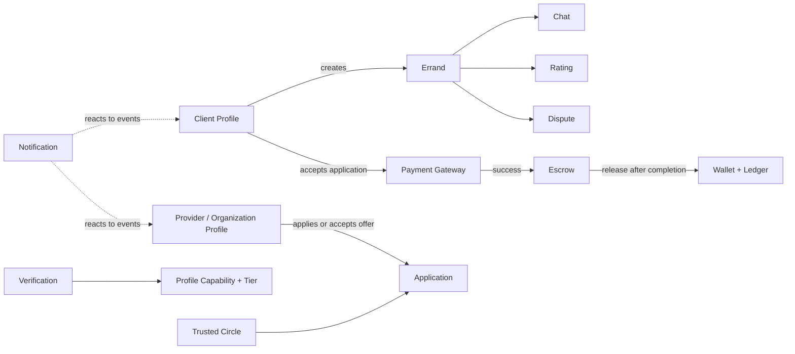

## Features

### Product Features

- [ ] User registration, login, sessions, OTP, social login via better-auth.
- [ ] Profile model for individuals and organizations.
- [ ] Client and provider capabilities on the same profile.
- [ ] Market isolation and multi-currency money model.
- [ ] Address creation, update, default address, and geocoding.
- [ ] Category and service listing.
- [ ] Errand creation, publishing, discovery, assignment, completion, cancellation, archive.
- [ ] Provider applications and direct offers.
- [ ] Application acceptance flow with charge, escrow creation, errand assignment, and competing-application rejection.
- [ ] Escrow hold, release, refund, and dispute-aware auto-release.
- [ ] Wallet ledger, balance projection, withdrawal, bank account verification, reconciliation.
- [ ] Trusted circle member management and share/confirm workflows.
- [ ] Chat rooms, durable messages, media metadata, read/delivery state.
- [ ] Ratings, replies, reactions, public/internal rating contexts.
- [ ] Verification review, automatic KYC review, admin approval/rejection.
- [ ] Dispute opening, review assignment, resolution, escrow outcome.
- [ ] Notifications across email, SMS, push, and in-app targets.

### Platform Features

- [ ] CQRS commands and queries per module.
- [ ] Domain events with consistent `payload` shape.
- [ ] Thin sagas for single-hop event-to-command reactions.
- [ ] Persisted progress entities for money-critical async flows.
- [ ] BullMQ processors for resumable asynchronous continuations.
- [ ] Dead letter channel for permanent failures.
- [ ] Error classification into transient and permanent failures.
- [ ] Append-only ledger as source of truth for money movement.
- [ ] Materialized read models for wallet balances and dashboards.
- [ ] Idempotent receivers for payment, ledger, queues, and events.
- [ ] Correlation IDs across synchronous business cascades.

## Architecture

Errandy is documented as a modular monolith with strict boundaries. Each bounded context owns its domain model, application use cases, infrastructure adapters, and presentation shape.

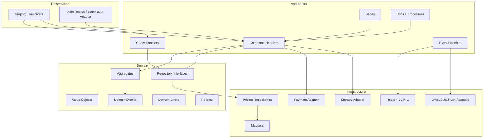

### Layer Rules

- Domain code owns business rules and must not depend on Prisma, GraphQL, Redis, BullMQ, or external SDKs.
- Application code orchestrates commands, queries, events, sagas, jobs, and policies.
- Infrastructure code implements repositories and adapters.
- Presentation code exposes GraphQL and auth-facing contracts.
- Cross-module state changes happen through commands/events, not direct aggregate mutation.

## Domain Model

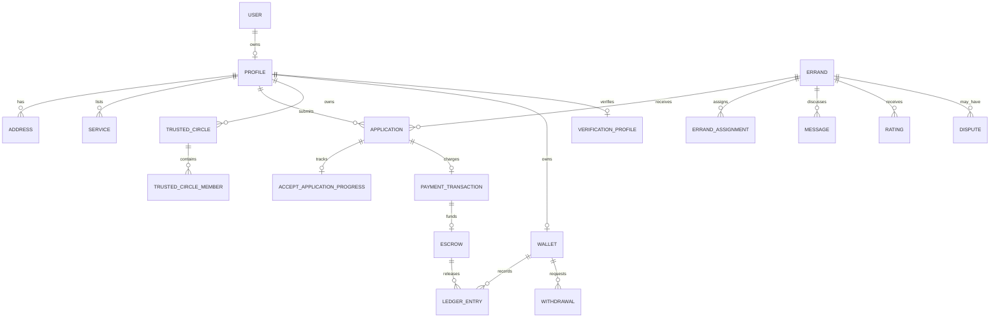

### Module Completion Tracker

Use this table as the living implementation checklist.

| Module | Target responsibility | Done |
|---|---|---|
| Auth | better-auth identity, sessions, email/phone OTP, social login, admin plugin | [ ] |
| Profile / Party | Individual and organization profiles, capabilities, provider stats, badges | [ ] |
| Address | Saved addresses, default address, coordinates/geocoding | [ ] |
| Category | Hierarchical categories with leaf tier requirements | [ ] |
| Service | Provider/org services tied to categories and money | [ ] |
| Errands | Errand lifecycle, assignment, completion, archive, cancellation | [ ] |
| Application | Bids/direct offers, acceptance progress, rejection | [ ] |
| Payment Gateway | Charge/refund transactions, webhooks, reconciliation | [ ] |
| Escrow | Held funds, release/refund, auto-release guard | [ ] |
| Wallet | Ledger, snapshots, withdrawals, bank accounts, reconciliation | [ ] |
| Trusted Circle | Trusted members, suggestions, confirmations | [ ] |
| Verification | KYC steps, admin/system review, completion events | [ ] |
| Dispute | Evidence, reviewer assignment, resolution, escrow outcome | [ ] |
| Rating | Public/internal ratings, replies, reactions, aggregates | [ ] |
| Chat | Rooms, participants, messages, read/delivery state | [ ] |
| Notification | Event-driven email, SMS, push, in-app messages | [ ] |
| Search / Discovery | Geo, market, category, tier, trust and recency ranking | [ ] |

## Technology Stack

| Area | Target technology |
|---|---|
| Runtime | Node.js |
| Framework | NestJS |
| API | GraphQL, Apollo |
| Auth | better-auth |
| Persistence | MongoDB |
| ORM | Prisma |
| Queue | BullMQ |
| Queue backend | Redis |
| Payments | Paystack-oriented payment gateway adapter |
| Email | Resend/Nodemailer-style adapter |
| SMS | Twilio-style adapter |
| Push/storage | Firebase |
| Deployment | Docker, Kubernetes, DigitalOcean, Cloudflare |
| Testing | Jest, e2e tests |
| Tooling | TypeScript, ESLint, Prettier |

## Project Structure

Target module shape:

```text
src/modules/<module>/
  domain/
    entities/
    value-objects/
    repositories/
    events/
    errors/
  application/
    commands/
    queries/
    event-handlers/
    sagas/
    processors/
    jobs/
  infrastructure/
    mappers/
    repositories/
    adapters/
  presentation/
    graphql/
    resolvers/
  <module>.module.ts
```

Documentation shape:

```text
docs/
  module/
    address.md
    application.md
    chat.md
    dispute.md
    errands.md
    escrow.md
    notification.md
    payment-gateway.md
    rating.md
    service.md
    trusted-circle.md
    verification.md
    wallet.md
  flow/
    application-accept-flow.md
    dispute-flow.md
    errand-completion-flow.md
    errand-creation-flow.md
    errand-discovery-flow.md
    errand-reassignment-flow.md
    rating-flow.md
    trusted-circle-flow.md
    user-registration-flow.md
    verification-flow.md
    withdrawal-flow.md
```

## Design Patterns

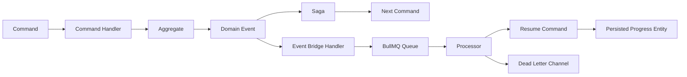

Core patterns:

- **Aggregate Root**: protects invariants inside a bounded context.
- **Value Object**: typed IDs, money, status, coordinates, and classification values.
- **Repository Interface**: domain-owned contracts, infrastructure-owned implementations.
- **CQRS**: commands mutate state; queries read state.
- **Domain Event**: event classes carry metadata plus a consistent `payload`.
- **Saga**: thin event-to-command hop with no persisted state.
- **Progress Entity**: persisted state machine for money-critical async flows.
- **Idempotent Receiver**: duplicate commands/events/jobs safely no-op.
- **Dead Letter Channel**: permanent failure payloads are stored for investigation/replay.
- **Materialized View**: read-optimized projections such as wallet balances.
- **Append-Only Ledger**: wallet money movement source of truth.
- **Correlation Identifier**: cascades share one correlation ID until direct consequences end.

## Prerequisites

- Node.js LTS.
- pnpm.
- MongoDB connection string.
- Redis instance.
- Provider credentials for enabled integrations.
- Docker, if running via containers.
- Kubernetes/DigitalOcean/Cloudflare tooling for production deployment.

## Installation

```bash
pnpm install
pnpm prisma
```

## Configuration

Create a `.env` file for local development.

| Variable | Purpose |
|---|---|
| `DATABASE_URL` | MongoDB connection URL used by Prisma |
| `PORT` | HTTP server port |
| `REDIS_HOST` | Redis host for BullMQ |
| `REDIS_PORT` | Redis port |
| `REDIS_PASSWORD` | Redis password |
| `REDIS_URL` | Optional Redis connection URL |
| `GOOGLE_CLIENT_ID` | Google auth provider client ID |
| `GOOGLE_CLIENT_SECRET` | Google auth provider secret |
| `RESEND_API_KEY` / `RESEND_API` | Email provider key, depending on adapter |
| `FIREBASE_SERVICE_ACCOUNT_KEY` | Firebase service account path |
| `FIREBASE_STORAGE_BUCKET` | Firebase storage bucket |
| `PAYSTACK_SECRET_KEY` | Payment gateway secret |
| `TWILIO_*` | SMS provider settings |

Configuration checklist:

- [ ] `.env.example` documents every required variable.
- [ ] Startup validates required variables.
- [ ] Secrets are not committed.
- [ ] Production secrets are loaded through secret manager/Kubernetes secrets.

## Running the Project

```bash
pnpm start:dev
```

Production-style:

```bash
pnpm build
pnpm start:prod
```

Worker:

```bash
pnpm start:worker
```

Docker Compose target:

```bash
docker compose up
```

## Database

The documented persistence model uses Prisma with MongoDB. Money is represented in minor units with explicit currency. Wallet movement is ledger-first, with snapshots used for fast display.

Database checklist:

- [ ] Prisma schema reflects all documented modules.
- [ ] Unique constraints protect idempotency keys and one-per-business-rule invariants.
- [ ] Indexes exist for queue processors, dashboards, status scans, and discovery queries.
- [ ] Seed data exists for markets and categories.
- [ ] Migration guide exists for each breaking schema change.
- [ ] Ledger reconciliation can rebuild wallet projections.

## API

Target API is GraphQL with resolvers dispatching `CommandBus` and `QueryBus`.

API checklist:

- [ ] GraphQL schema exposes public application operations.
- [ ] GraphQL schema exposes wallet and escrow read models.
- [ ] Mutations validate input DTOs.
- [ ] Resolvers never access repositories directly.
- [ ] Cursor pagination is used for lists.
- [ ] API errors follow the normalized error shape.
- [ ] Schema docs are generated and committed when required.

## Authentication & Authorization

Auth is owned by better-auth. Domain modules should receive authenticated user/profile context from the application layer rather than implementing credential logic.

Authorization checklist:

- [ ] better-auth email/password enabled.
- [ ] Email OTP verification configured.
- [ ] Phone OTP verification configured.
- [ ] Google provider configured.
- [ ] Admin plugin and permission resources configured.
- [ ] Profile creation happens through anti-corruption event from auth user creation.
- [ ] Command handlers enforce ownership/role/permission policies.
- [ ] Admin users are supported without requiring a profile.

## Event System

Domain events are used for decoupling modules. Events should carry:

- `eventId`
- `occurredAt`
- `aggregateId`
- `eventName`
- `correlationId`
- `payload`

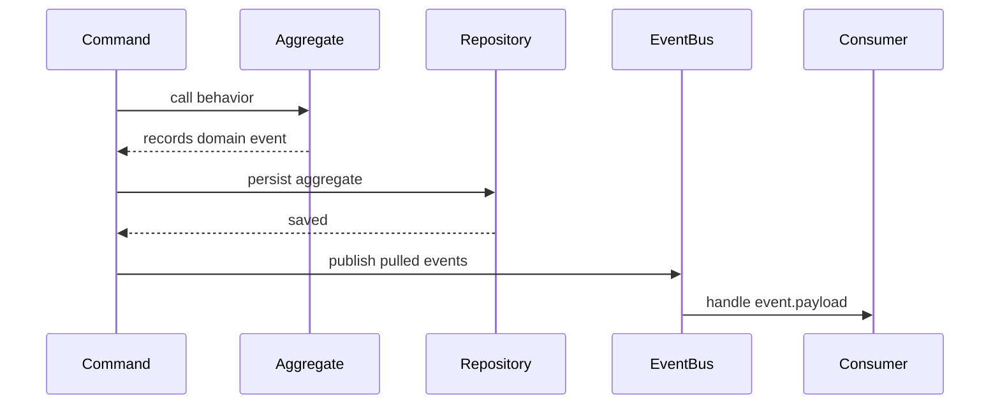

Event checklist:

- [ ] Every event uses a consistent `payload`.
- [ ] Every event includes `correlationId` when part of a business cascade.
- [ ] Event consumers are idempotent.
- [ ] Notification events stop the business cascade.
- [ ] Arbitrary-delay workflows start a fresh `correlationId`.

## Queues & Background Jobs

Queues handle money-critical continuations, delayed jobs, retries, and sweeps.

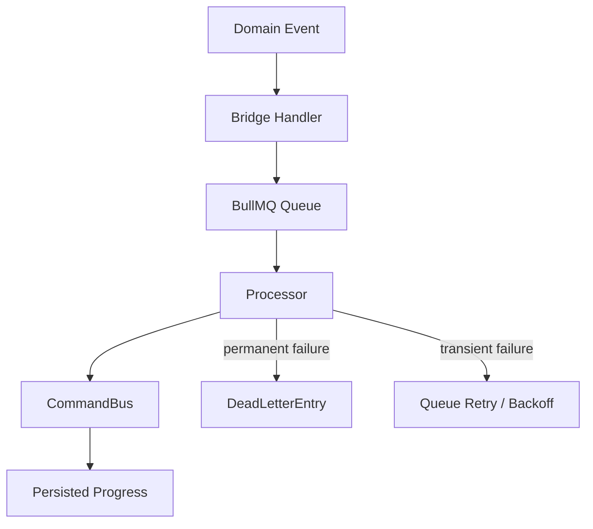

Queue checklist:

- [ ] Application acceptance continuation queue.
- [ ] Withdrawal continuation queue.
- [ ] Bank account resolution queue.
- [ ] Escrow auto-release job.
- [ ] Auto-accept errand job.
- [ ] Ledger reconciliation job.
- [ ] Stuck withdrawal sweep job.
- [ ] Dead letter records include queue name, payload, reason, attempt count, permanence.

## Caching

Caching target:

- Redis for queues and ephemeral infrastructure concerns.
- Materialized read models for durable projections.
- No cache should be the source of truth for money.

Caching checklist:

- [ ] Wallet balances are rebuildable from ledger.
- [ ] Provider/client dashboard stats are rebuildable.
- [ ] Cache invalidation rules are documented per read model.
- [ ] Redis outage behavior is documented.

## File Storage

File storage target:

- Verification documents.
- Dispute evidence.
- Chat attachments.
- Optional errand proof URLs.

File storage checklist:

- [ ] Storage adapter interface exists.
- [ ] Firebase/S3-like implementation exists.
- [ ] File upload size/type limits are enforced.
- [ ] Events carry claim-check references, not file blobs.
- [ ] Private documents are access-controlled.

## Payments

Payments are handled through a gateway anti-corruption layer. The payment module owns external transaction state; escrow and wallet own internal money state.

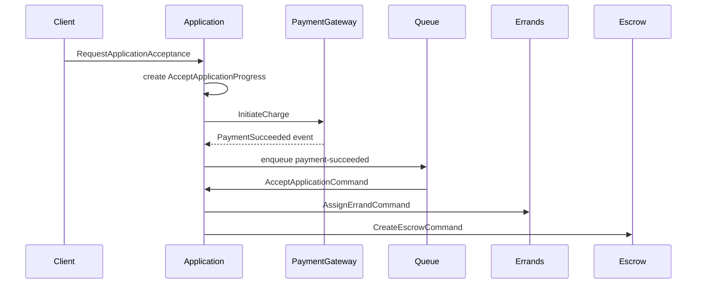

Payment checklist:

- [ ] Payment transaction aggregate.
- [ ] Payment method storage.
- [ ] Charge initiation.
- [ ] Webhook verification.
- [ ] Payment success/failure events.
- [ ] Refund command.
- [ ] Gateway reconciliation job.
- [ ] Idempotent webhook handling.
- [ ] Payment-to-application bridge handler.
- [ ] Service-booking payment path.

## Logging

Logging checklist:

- [ ] Structured logs include `correlationId`.
- [ ] Queue processors log job ID and queue name.
- [ ] Permanent failures log dead-letter ID.
- [ ] Sensitive data is redacted.
- [ ] Domain errors are logged without stack spam unless unexpected.

## Monitoring & Observability

Observability checklist:

- [ ] Health endpoint.
- [ ] Readiness endpoint.
- [ ] Queue depth metrics.
- [ ] Job failure metrics.
- [ ] Payment webhook metrics.
- [ ] Ledger reconciliation metrics.
- [ ] API latency metrics.
- [ ] Error rate dashboards.
- [ ] Alerting for queue backlog, DLQ growth, payment failures, and reconciliation drift.

## Error Handling

Domain errors should stay framework-agnostic while carrying enough metadata for HTTP/GraphQL normalization.

Error handling checklist:

- [ ] Domain errors carry stable `code`.
- [ ] Domain errors carry status classification.
- [ ] GraphQL exception filter normalizes all errors.
- [ ] Error classifiers distinguish transient and permanent queue failures.
- [ ] Permanent async failures are dead-lettered.
- [ ] Unexpected errors map to internal server error.

## Security

Security checklist:

- [ ] Secrets stored outside source control.
- [ ] CORS allowed origins reviewed.
- [ ] Auth cookies/session settings hardened.
- [ ] Admin permissions enforced in command handlers.
- [ ] Payment webhooks verify signatures.
- [ ] Uploads validate content type and size.
- [ ] Rate limiting on auth and mutation endpoints.
- [ ] PII redaction in logs.
- [ ] Dependency vulnerability checks in CI.

## Testing

Testing checklist:

- [ ] Domain aggregate unit tests.
- [ ] Value object tests.
- [ ] Command handler tests.
- [ ] Query handler tests.
- [ ] Saga tests.
- [ ] Processor retry/dead-letter tests.
- [ ] Repository integration tests.
- [ ] GraphQL resolver tests.
- [ ] Auth flow tests.
- [ ] Payment webhook tests.
- [ ] Wallet ledger/reconciliation tests.
- [ ] e2e tests for critical flows.

## Performance

Performance checklist:

- [ ] Discovery queries have geo/status/category/market indexes.
- [ ] Wallet balance reads use projections.
- [ ] Ledger history is paginated.
- [ ] Chat history is paginated.
- [ ] Queue processors are horizontally scalable.
- [ ] Large files are stored externally.
- [ ] Reconciliation jobs run incrementally where possible.

## Development Workflow

Suggested workflow:

1. Update the relevant `docs/module/*` or `docs/flow/*` file.
2. Add or update the checklist item in this README.
3. Implement domain behavior first.
4. Add application command/query orchestration.
5. Add infrastructure adapters/repositories.
6. Add presentation layer.
7. Add tests.
8. Mark checklist item complete.

Commands:

```bash
pnpm format
pnpm lint
pnpm test
pnpm test:e2e
pnpm prisma
```

## CI/CD

CI/CD checklist:

- [ ] Install dependencies.
- [ ] Generate Prisma client.
- [ ] Type-check.
- [ ] Lint.
- [ ] Unit tests.
- [ ] e2e tests.
- [ ] Build Docker image.
- [ ] Scan dependencies/container image.
- [ ] Push image.
- [ ] Deploy to target environment.
- [ ] Run smoke checks.

## Deployment

Deployment target is containerized NestJS API plus worker, Redis, MongoDB, and ingress.

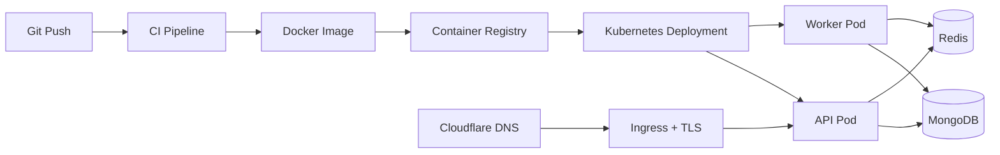

Deployment checklist:

- [ ] Docker image builds reproducibly.
- [ ] API and worker have separate process commands.
- [ ] Redis is reachable from both API and worker.
- [ ] MongoDB credentials are provisioned.
- [ ] Kubernetes secrets are generated.
- [ ] TLS certificate is issued.
- [ ] Cloudflare DNS is configured.
- [ ] Rollback procedure is documented.

See `DEPLOYMENT.md` for the Kubernetes/DigitalOcean deployment guide.

## Troubleshooting

| Problem | Check |
|---|---|
| API fails to start | Environment variables, Prisma client, database connection |
| GraphQL returns internal error | Exception filter logs, domain error code, resolver input |
| Queue jobs stuck | Redis connection, worker process, BullMQ queue name |
| Payment flow stops after charge | Webhook receipt, progress row, bridge handler, queue processor |
| Wallet balance incorrect | Ledger entries, snapshot rebuild, reconciliation job |
| Upload fails | File size/type, storage credentials, bucket permissions |
| Auth session invalid | better-auth config, cookie settings, trusted origins |
| TLS not issuing | DNS-only Cloudflare record, cert-manager challenge logs |

## FAQ

**Are all modules implemented?**
No. This README describes the documented target system and provides checklists to track completion.

**Why not use mutable wallet balances as the source of truth?**
The documented design makes the ledger authoritative so money movement is auditable and replayable.

**When should a saga be used?**
Use a saga for a thin event-to-command hop with no persisted state. Use a progress entity for multi-step money-critical workflows.

**When does a correlation ID stop?**
It stops when direct synchronous consequences end. If another actor acts later, that is a new transaction with a fresh correlation ID.

**Why does every event use `payload`?**
It keeps event metadata consistent and makes handlers read business data from one predictable place.

## Roadmap

### Foundation

- [ ] Finalize auth integration.
- [ ] Finalize profile/party model.
- [ ] Finalize market and currency model.
- [ ] Finalize shared `Money`.
- [ ] Finalize domain error and event conventions.

### Marketplace

- [ ] Errand creation flow.
- [ ] Errand discovery flow.
- [ ] Application submission.
- [ ] Direct offer.
- [ ] Application acceptance.
- [ ] Reassignment suggestions.

### Money

- [ ] Payment gateway.
- [ ] Escrow.
- [ ] Wallet ledger.
- [ ] Withdrawal flow.
- [ ] Reconciliation.

### Trust & Safety

- [ ] Verification.
- [ ] Trusted circle.
- [ ] Rating.
- [ ] Dispute.
- [ ] Admin review permissions.

### Operations

- [ ] Notifications.
- [ ] Chat.
- [ ] Observability.
- [ ] Deployment hardening.
- [ ] CI/CD.

## Changelog

Keep notable changes here.

| Date | Change |
|---|---|
| TBD | Initial docs-first README with implementation checklists |

## Migration Guides

Migration checklist:

- [ ] Document schema changes.
- [ ] Document data backfill.
- [ ] Document rollout order.
- [ ] Document rollback plan.
- [ ] Document API compatibility impact.

Known migration themes:

- [ ] Legacy amount fields to `amountMinorUnits` + `currency`.
- [ ] Separate client/provider models to unified profile/party model.
- [ ] Mutable wallet balances to ledger-backed projections.
- [ ] Event classes to metadata + `payload` format.

## Contributing

Contribution checklist:

- [ ] Read the relevant module doc.
- [ ] Read the relevant flow doc.
- [ ] Update docs before or with implementation.
- [ ] Keep domain code persistence-ignorant.
- [ ] Add focused tests.
- [ ] Update README checklist items.

## Code of Conduct

Treat contributors with respect. Prefer clear technical discussion, written decisions, and small reviewable changes.

## Governance

Architecture changes should be documented through ADRs or updates to `docs/flow/errand-platform-architecture.md`. Money, auth, and cross-module event changes require extra review.

## Support

Support checklist:

- [ ] Issue template exists.
- [ ] Security contact exists.
- [ ] Operational runbooks exist.
- [ ] Incident response owner exists.

## Documentation

Primary documentation:

- `docs/flow/errand-platform-architecture.md`
- `docs/flow/application-accept-flow.md`
- `docs/flow/errand-completion-flow.md`
- `docs/flow/withdrawal-flow.md`
- `docs/flow/dispute-flow.md`
- `docs/flow/verification-flow.md`
- `docs/flow/trusted-circle-flow.md`
- `docs/flow/rating-flow.md`
- `docs/module/wallet.md`
- `docs/module/escrow.md`
- `docs/module/application.md`
- `docs/module/address.md`
- `docs/module/payment-gateway.md`

Documentation checklist:

- [ ] Each module has a `docs/module/<module>.md`.
- [ ] Each cross-module workflow has a `docs/flow/<flow>.md`.
- [ ] Diagrams are kept current.
- [ ] Open decisions are captured.
- [ ] Implemented status is reflected in this README.

## Dependencies

Dependency checklist:

- [ ] Runtime dependencies reviewed.
- [ ] Dev dependencies reviewed.
- [ ] License compatibility reviewed.
- [ ] Security vulnerabilities monitored.
- [ ] SDK integrations wrapped in adapters.

## License

This project is private and currently marked `UNLICENSED`.

## Acknowledgements

Errandy uses patterns from Domain-Driven Design, Enterprise Integration Patterns, CQRS, event-driven architecture, and ledger-based financial systems.

## Known Issues

- [ ] Some documented target modules may not yet be implemented.
- [ ] Some flow docs may describe future architecture rather than current runtime behavior.
- [ ] Deployment docs may require environment-specific adjustment.
- [ ] Auth/profile/party terminology must stay aligned across docs and code.

## Future Work

- [ ] Complete profile/party consolidation.
- [ ] Complete multi-currency market isolation.
- [ ] Complete application acceptance processor.
- [ ] Complete dispute-resolution-to-escrow flow.
- [ ] Complete wallet withdrawal processor.
- [ ] Complete observability stack.
- [ ] Complete admin permission model.
- [ ] Complete migration guides.

## Operations

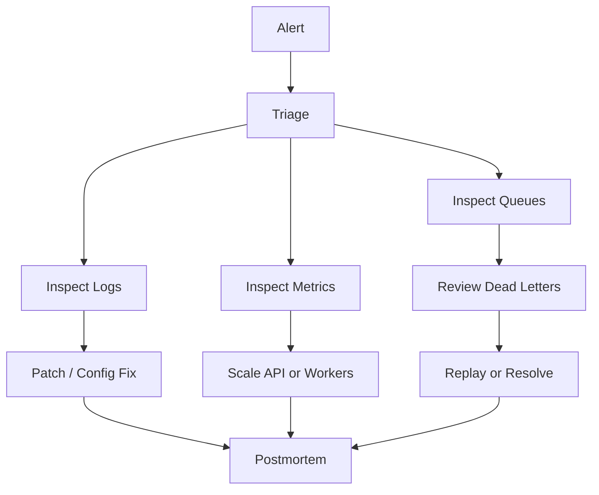

Operations checklist:

- [ ] Health checks.
- [ ] Queue dashboards.
- [ ] Dead-letter replay procedure.
- [ ] Payment incident runbook.
- [ ] Ledger reconciliation runbook.
- [ ] Database backup/restore procedure.
- [ ] Secret rotation procedure.
- [ ] Deployment rollback procedure.

## Architecture Decision Records ADRs

ADR checklist:

- [ ] Unified profile/party model.
- [ ] better-auth owns identity.
- [ ] Multi-currency market isolation.
- [ ] Ledger as wallet source of truth.
- [ ] Progress entity over process-manager class for application acceptance.
- [ ] Withdrawal debits immediately on request.
- [ ] Disputes only after errand completion.
- [ ] Rating contexts: public client-facing vs internal.
- [ ] Consistent domain event payload shape.
- [ ] Domain errors normalized at presentation boundary.

## Appendix

### Correlation ID Rule

- Generate a fresh `correlationId` at the top-level command.
- Reuse it for direct consequences in the same business cascade.
- Stop when direct consequences stop.
- Start a fresh ID after arbitrary real-world delay or a different actor's later action.

### Application Acceptance State Machine

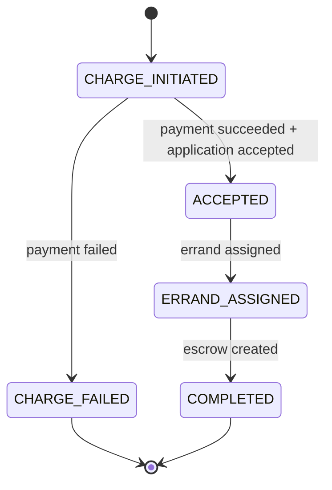

### Wallet Flow

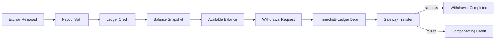

### Completion Tracker Legend

- `[ ]` Not complete or not verified.
- `[x]` Complete and verified.
- Add notes beside checklist items when partial implementation exists.